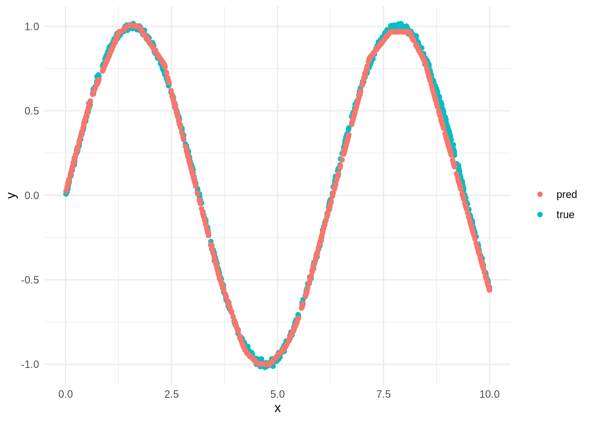
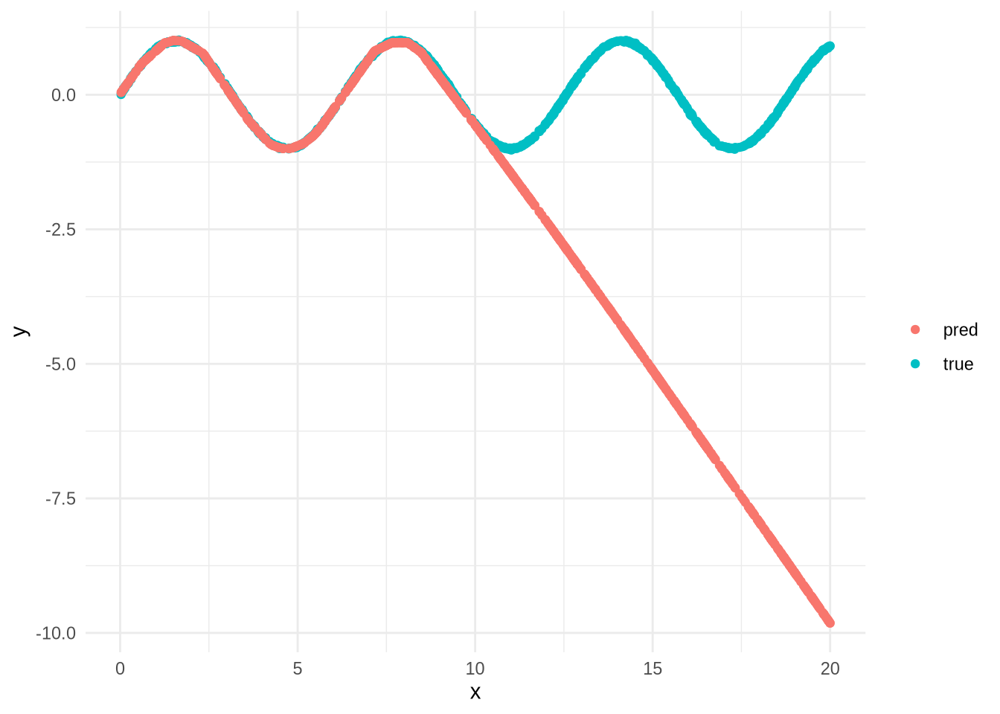
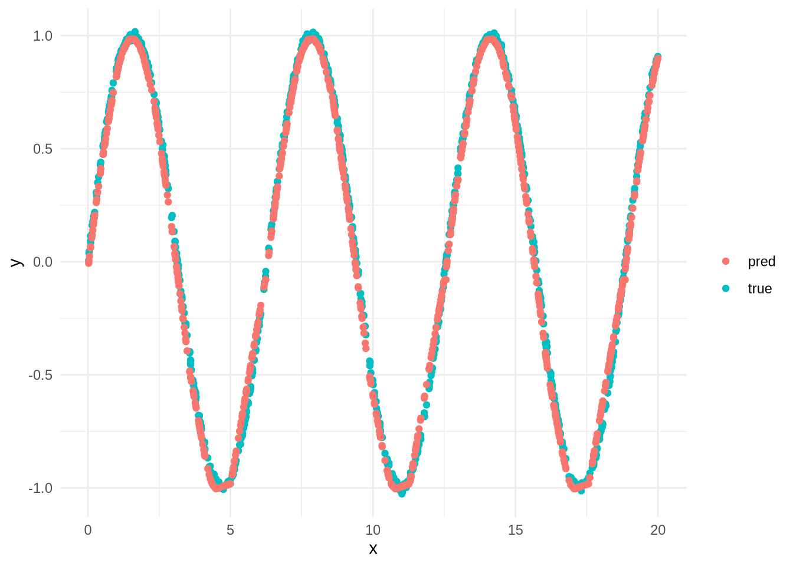

---
title: "It's a Sin(us)"
---


**Question 1**: Create a `torch::dataset` class that takes in arguments `n`, `min`, and `max` during initialization where:

* `n` is the total number of samples
* `min` is the lower bound of the data
* `max` is the upper bound of the data

In the `initialize` method, generate and store:

* a tensor `x` of shape `(n, 1)` that contains `n` values drawn from a uniform distribution between `min` and `max`
* a tensor `y` of shape `(n, 1)` that is defined as $\sin(x) + \epsilon$ where $\epsilon$ is drawn from a normal distribution with mean 0 and standard deviation 0.1

<details>
<summary>Hint</summary>
Use `torch_randn()` to draw from a standard normal distribution and multiply it with `0.1^2` to get the desired standard deviation.
</details>

Implement the `$.getbatch()` method to return a named list with values `x` and `y`.
Then, create an instance of the dataset with `n = 1000`, `min = 0`, and `max = 10`.

Make sure that the dataset is working by calling the  `$.getbatch()` method.
Also, check that the shapes of both tensors returned by the dataset are `(n_batch, 1)`.

::: {.content-visible when-meta=solutions}
**Solution**


::: {.cell layout-align="center"}

```{.r .cell-code}
library(torch)
sin_dataset <- dataset(
  initialize = function(n, min, max) {
    self$x <- torch_rand(n, 1) * (max - min) + min
    self$y <- torch_sin(self$x) + torch_randn(n, 1) * 0.1^1
  },
  .getbatch = function(i) {
    list(x = self$x[i, drop = FALSE], y = self$y[i, drop = FALSE])
  },
  .length = function() {
    length(self$x)
  }
)
ds <- sin_dataset(n = 1000, min = 0, max = 10)
batch <- ds$.getbatch(1:10)
batch$x$shape
```

::: {.cell-output .cell-output-stdout}

```
[1] 10  1
```


:::

```{.r .cell-code}
batch$y$shape
```

::: {.cell-output .cell-output-stdout}

```
[1] 10  1
```


:::
:::

:::

**Question 2**: Create a `torch::dataloader` that takes in the dataset and returns batches of size 10.
Then, iterate over the batches of the dataloader and create one tensor `X` and one tensor `Y` that contains the concatenated batches of `x` and `y`.

<details>
<summary>Hint</summary>
The functions `coro::loop()` and `torch_cat()` might be helpful.
</details>

::: {.content-visible when-meta=solutions}
**Solution**


::: {.cell layout-align="center"}

```{.r .cell-code}
dl <- dataloader(ds, batch_size = 10)
batches <- list()
coro::loop(for (batch in dl) {
  batches <- c(batches, list(batch))
})
X <- torch_cat(lapply(batches, function(batch) batch$x), dim = 1)
Y <- torch_cat(lapply(batches, function(batch) batch$y), dim = 1)
```
:::

:::

**Question 3**: Create a custom torch module that allows modeling the sinus data we have created. To test it, apply it to the tensor `X` we have created above and calculate its mean squared error with the tensor `Y`.

<details>
<summary>Hint</summary>
You can either use `nn_module` to create a custom module generically, or you can use `nn_sequential()` to create a custom module that is a sequence of layers.
</details>

::: {.content-visible when-meta=solutions}
**Solution**


::: {.cell layout-align="center"}

```{.r .cell-code}
nn_sin <- nn_module("nn_sin",
  initialize = function(latent = 200) {
    self$lin1 <- nn_linear(1, latent)
    self$lin2 <- nn_linear(latent, latent)
    self$lin3 <- nn_linear(latent, 1)
  },
  forward = function(x) {
    x |>
      self$lin1() |>
      nnf_relu() |>
      self$lin2() |>
      nnf_relu() |>
      self$lin3()
  }
)
net <- nn_sin(200)
Y_pred <- with_no_grad(net(X))
nnf_mse_loss(Y_pred, Y)
```

::: {.cell-output .cell-output-stdout}

```
torch_tensor
1.08382
[ CPUFloatType{} ]
```


:::
:::

:::

**Question 4**: Train the model on the task for different hyperparameters (`lr` or `epochs`) and visualize the results. Play around with the hyperparameters until you get a good fit. You can use the following code for that:


::: {.cell layout-align="center"}

```{.r .cell-code}
library(ggplot2)
predict_network <- function(net, dataloader) {
  local_no_grad()
  xs <- list(x = numeric(), y = numeric(), pred = numeric())
  i <- 1
  net$eval()
  coro::loop(for (batch in dataloader) {
    xs$x <- c(xs$x, as.numeric(batch$x))
    xs$y <- c(xs$y, as.numeric(batch$y))
    xs$pred <- c(xs$pred, as.numeric(net(batch$x)))
  })
  as.data.frame(xs)
}
train_network <- function(net, dataloader, epochs, lr) {
  optimizer <- optim_ignite_adamw(net$parameters, lr = lr)
  net$train()
  for (i in seq_len(epochs)) {
    coro::loop(for (batch in dataloader) {
      optimizer$zero_grad()
      Y_pred <- net(batch$x)
      loss <- nnf_mse_loss(Y_pred, batch$y)
      loss$backward()
      optimizer$step()
    })
  }
  predict_network(net, dataloader)
}
plot_results <- function(df) {
  ggplot(data = df, aes(x = x)) +
    geom_point(aes(y = y, color = "true")) +
    geom_point(aes(y = pred, color = "pred")) +
    theme_minimal()
}
train_and_plot <- function(net, dataloader, epochs = 10, lr = 0.01) {
  result <- train_network(net, dataloader, epochs = epochs, lr = lr)
  plot_results(result)
}
```
:::


:::{.callout-tip}
Beware of the reference semantics and make sure that you create a new instance of the network for each run.
:::

::: {.content-visible when-meta=solutions}
**Solution**


::: {.cell layout-align="center"}

```{.r .cell-code}
net <- nn_sin(200)
train_and_plot(net, dl, epochs = 200, lr = 0.01)
```

::: {.cell-output-display}
{fig-align='center' width=672}
:::
:::

:::

**Question 5**: Create a new instance from the sinus dataset class created earlier.
Now, set the `min` and `max` values to `10` and `20` respectively and visualize the results. What do you observe? Can you explain why this is happening and can you fix the network architecture to make it work?

<details>
<summary>Hint</summary>
The sinus function has a phase of $2 \pi$.
</details>

::: {.content-visible when-meta=solutions}
**Solution**


::: {.cell layout-align="center"}

```{.r .cell-code}
dl_ood <- dataloader(sin_dataset(n = 1000, min = 0, max = 20), batch_size = 10)
plot_results(predict_network(net, dl_ood))
```

::: {.cell-output-display}
{fig-align='center' width=672}
:::
:::


For values out of the range `[0, 10]`, the network fails to generalize. This is because the network only observed values in the range `[0, 10]` during training.

We can fix this by preprocessing the data


::: {.cell layout-align="center"}

```{.r .cell-code}
nn_sin2 <- nn_module("nn_sin2",
  initialize = function(latent = 200) {
    self$lin1 <- nn_linear(1, latent)
    self$lin2 <- nn_linear(latent, latent)
    self$lin3 <- nn_linear(latent, 1)
  },
  forward = function(x) {
    (x %% (2 * pi)) |>
      self$lin1() |>
      nnf_relu() |>
      self$lin2() |>
      nnf_relu() |>
      self$lin3()
  }
)
net2 <- nn_sin2(200)
df <- train_network(net2, dl, epochs = 200, lr = 0.01)
plot_results(predict_network(net2, dl_ood))
```

::: {.cell-output-display}
{fig-align='center' width=672}
:::
:::

:::


